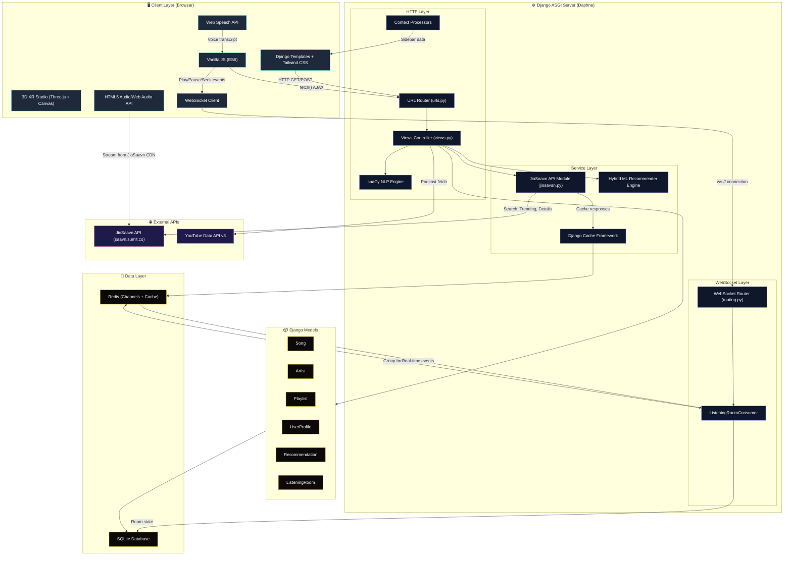

<div align="center">
  
</div>
"

<h1 align="center">SoulPlayer</h1>

<p align="center">
  <a href="#overview">Overview</a> •
  <a href="#architecture">Architecture</a> •
  <a href="#core-features">Features Deep-Dive</a> •
  <a href="#tech-stack">Tech Stack</a> •
  <a href="#installation">Installation</a> •
  <a href="#license">License</a>
  </p>

<p align="center">
  <b>A premium, feature-rich music streaming web application built with Django, Django Channels, and Tailwind CSS.</b>
</p>

---

## 📖 Overview

SoulPlayer is a modern, high-performance web-based music streaming platform designed with a focus on premium aesthetics and intelligent features. Developed primarily with the Django framework and styled rapidly using Tailwind CSS, SoulPlayer brings desktop-class media streaming experiences to the browser. 

Beyond standard playback functionality, the platform differentiates itself with advanced features like **Natural Language Voice Search (NLP)**, **Real-Time Listening Rooms (Live Jams)**, **JioSaavn API Integration** for unlimited music streaming, and **Dynamic Background Play Tracking**.

---
## 🔥🔥 Newly Added Feature
### 🎯 New Premium Feature real time AR-VR experience 


---


---


---


---


---


---


 ---

## 🏗️ Architecture & System Design

SoulPlayer follows a classic **Model-View-Template (MVT)** architecture utilized by Django, augmented with **ASGI (Daphne)** for asynchronous operations, **Django Channels** for real-time WebSocket communication, and vanilla JavaScript for asynchronous frontend operations (AJAX) to maintain a seamless, single-page-application feel during media playback.

<details>
<summary><b>Click to expand Architectural Flow</b></summary>

1. **Client Layer (The Browser):** Renders the UI using HTML rendered by Django Templates and Tailwind CSS for styling. Global event listeners capture media playback actions.
2. **Asynchronous Handlers (Vanilla JS `fetch` APIs):** When a user plays a song, the global `audio` element begins streaming the buffer. Simultaneously, an invisible `/record_play/<id>/` POST request is fired to the backend, complete with explicit CSRF token verification, to track user listening history.
3. **WebSocket Layer (Django Channels + Redis):** Real-time features like Live Listening Rooms use WebSocket connections managed by Django Channels with a Redis channel layer. This enables synchronized audio playback, live chat, and song change notifications across all connected clients.
4. **Routing Layer (`music/urls.py`):** Django's URL dispatcher routes incoming REST-like endpoints and standard GET requests to the appropriate controller views. WebSocket routes are handled separately via `music/routing.py`.
5. **Controller Layer (`music/views.py`):** Handles the core business logic. 
    - Queries the database via the Django ORM.
    - Processes Natural Language queries through the `spaCy` NLP engine.
    - Interfaces with the JioSaavn API for external music streaming.
    - Makes external calls to the Google/YouTube Data API for podcast ingestion.
6. **External API Layer (`music/jiosavan.py`):** A dedicated service module that wraps the unofficial JioSaavn API for song search, trending charts, song details, suggestions, and streaming URLs. Implements intelligent caching via Django's cache framework, quality selection for audio and images, and multi-tier fallback strategies for trending content.
7. **Data Layer (`models.py` & SQLite Database):** Stores the relational mapping of Users, UserProfiles (1-to-1 User mapping), Artists, Songs, Playlists (Many-to-Many relationships), and ListeningRooms for collaborative sessions.
</details>

---
## System Architecture 

### Original Architecture


### Updated Architecture (with Live Jams, JioSaavn & WebSockets)



---

## 🌟 Core Features Deep-Dive

### 1. 🎙️ Natural Language Voice Search (NLP)
Instead of forcing users to explicitly filter by artist or genre, SoulPlayer integrates **spaCy**, an industry-level Natural Language Processing library.
* **How it works:** When a user searches *"play some romantic arijit singh songs"*, the NLP pipeline intercepts the query. It categorizes grammatical tokens, actively stripping out stop words (*"some", "songs", "play"*) to isolate target keywords. It then routes the request intelligently—if it finds an exact song match, it auto-plays it. If it finds an artist match, it redirects to the Artist Portfolio.
* **Voice Search UI:** A dedicated full-screen voice search interface (`/voice_search/`) uses the Web Speech API for browser-native speech recognition. It features animated ripple effects, real-time audio visualizer bars, and auto-submission to the NLP search pipeline upon voice capture.

### 2. 🎧 Real-Time Listening Rooms (Live Jams)
SoulPlayer features collaborative listening rooms powered by **Django Channels** and **Redis**, enabling synchronized music experiences across multiple users.
* **WebSocket Architecture:** Uses `ListeningRoomConsumer` for real-time bidirectional communication. Events include `play`, `pause`, `change_song`, and `chat` actions, all broadcast to every connected client in the room group.
* **Host/Guest Model:** The room creator (host) has full playback controls—play, pause, seek, and search for new tracks. Guests receive synchronized audio state updates with a 2-second tolerance threshold for seamless sync.
* **Live In-Room Chat:** Real-time text chat alongside synchronized music playback. System messages announce join/leave events. Chat UI features self/other message styling with avatar initials and timestamps.
* **Room Management:** Rooms are created with unique 6-character alphanumeric codes. Hosts can search and swap tracks mid-session using an in-room JioSaavn search interface that updates the backend and notifies all guests.
* **Lobby Interface:** A premium glass-morphism lobby (`/jam/lobby/`) allows users to create new rooms or join existing ones via room codes.

### 3. 🎵 JioSaavn API Integration
SoulPlayer integrates with the unofficial JioSaavn API to provide access to millions of songs without requiring any API keys.
* **Song Search & Streaming:** Search across JioSaavn's entire catalog and stream songs directly at up to 320kbps quality. Results are normalized into a consistent format and seamlessly integrated into the SoulPlayer UI.
* **Trending Charts:** Fetches songs from official JioSaavn chart playlists (Top 50 Hindi, Trending Today, Bollywood Hits) with deduplication and intelligent fallback to curated search queries if playlist endpoints fail.
* **Trending Today:** A dedicated "Trending Today" section that dynamically discovers and fetches the official JioSaavn "Trending Today" playlist, cached for 30 minutes for optimal performance.
* **Song Suggestions:** "Up Next" recommendations powered by JioSaavn's suggestion engine, displayed on the full-screen player with smooth navigation between suggested tracks.
* **Playlist Integration:** JioSaavn songs can be added to user playlists directly from search results or trending sections via a context menu. Songs are synced to the local database on first interaction.
* **Caching Layer:** All trending data is cached using Django's cache framework (Redis in production, in-memory for development) with configurable TTLs (1 hour for trending, 30 minutes for Trending Today, 24 hours for playlist IDs).

### 4. 🎶 Premium Music Player & State Management
The project features a sleek, global bottom-bar player and a dedicated Full-Screen View (`/play_song/<id>`).
* **Design:** Utilizes modern "Glassmorphism" paradigms (blur backdrops, semi-transparent gradients, glowing accents).
* **DOM APIs:** Interacts deeply with the HTML5 `<audio>` API to calculate track duration, current timestamp precision, and smooth slider tracking.
* **Dual Source Playback:** Seamlessly handles both local library songs (uploaded files/external links) and JioSaavn streamed content with unified controls.
* **Previous/Next Navigation:** Intelligent navigation supporting both local song sequences and JioSaavn suggestion chains, with automatic song-end transition to the next track.

### 5. 🔄 Background Sync & User Profiles
We utilize Django Signals (`post_save`) to automatically attach an extended `UserProfile` model to every new user registration.
* **History Tracking:** JavaScript asynchronous `fetch` requests bypass the need for full page reloads. As users listen to tracks (both local and JioSaavn), their `played_songs` Many-To-Many relationship is updated silently in the background via dedicated `/record_play/` and `/record_play_jiosaavn/` endpoints.
* **JioSaavn Song Sync:** When a JioSaavn song is played or added to a playlist for the first time, it is automatically synced to the local database with all metadata (title, artist, duration, image, stream URL, JioSaavn ID).
* **Dashboard:** Users have a dedicated customizable Profile page featuring listening history, favorite artist collections, tracks played stats, and profile editing capabilities.
* **Favorite Artists:** Users can toggle favorite/follow status on artist detail pages, which appears on their profile dashboard.

### 6. 🎙️ YouTube Podcast Integration
SoulPlayer isn't just limited to local database music. It uses the `requests` library to interface with the **YouTube Data API v3**. It dynamically queries YouTube for high-quality music podcasts, parses the incoming JSON, and renders fully playable media cards directly within the SoulPlayer UI.

### 7. 🎨 Premium UI/UX Design
* **Hero Carousel:** An auto-sliding 3-slide hero section with manual navigation arrows, dot indicators, and pause-on-hover functionality.
* **Infinite Scroll Cards:** Moods & Genres and Popular Artists sections feature CSS-animated auto-scrolling card strips with pause-on-hover.
* **Global Sidebar:** A shared sidebar across all pages via Django context processors, showing playlists, recent songs, and navigation links including the Live Jams feature with a pulsing broadcast icon.
* **Responsive Layout:** Full desktop layout with sidebar, top navigation, and bottom player bar. Mobile-optimized with responsive breakpoints.
* **Add to Playlist:** Context menu dropdown for adding JioSaavn songs to user playlists directly from any song card.

### 8. 🤖 Machine Learning Recommendation Engine
SoulPlayer features a hybrid, personalized recommendation pipeline designed to analyze listening habits and song features.
* **Hybrid Recommender System:** Blends Content-Based Filtering (using TF-IDF on genres, tags, and artists) and Collaborative Filtering (analyzing patterns from mathematically similar users). 
* **Prioritized Engine Logic:** Implements a multi-tier fallback: Cache → Real-time Hybrid calculation → Trending/Popularity fallback (for cold-start new users).
* **Asynchronous Training:** Features a dedicated `train_recommendations` background command to pre-compute and store heavy vector math in the database.
* **Made For You Interface:** A premium glassmorphism "Recommended" interface dynamically serving AI-curated feeds to listeners.

### 9. 🕶️ 3D Immersive XR Studio (Three.js)
SoulPlayer escapes the flat 2D player limitation with a full 3D interactive WebGL environment using **Three.js**.
* **True 3D Audio-Reactive World:** 360° mouse look-around camera controls (OrbitControls) drops users onto a reflective grid floor with 64 dynamic frequency pillars, floating particles, and a central deforming orb. Web Audio API live-analyzes track frequencies to dynamically warp geometries and scale lights.
* **Cinematic Genre Themes:** 9 custom environmental themes (Cosmic, Romance, Pop, Rock, Hip-Hop, Indie, EDM, Classical, Lo-Fi) that alter sky gradients, lighting colors, fog densities, and waveform aesthetics.
* **Auto Genre Detection:** The engine parses metadata keywords ("metal", "dj", "acoustic", etc.) upon playing a track and automatically switches the 3D environment's theme to match the vibe.
* **Live In-World JioSaavn Search:** Fully functional in-world floating UI that lets users search the entire music catalog and enqueue tracks without terminating the 3D WebGL context.
---

## 🛠️ Tech Stack

### Backend
*   **Framework:** Django 4.x (Python)
*   **ASGI Server:** Daphne (for WebSocket + HTTP support)
*   **WebSockets:** Django Channels with Redis channel layer
*   **Database:** SQLite (Development & Free Tier Production ready)
*   **Caching:** Redis (Production) / In-memory LocMemCache (Development)
*   **NLP Engine:** spaCy (`en_core_web_sm`)
*   **Machine Learning:** Pandas, Scikit-Learn (TF-IDF Vectorization, Cosine Similarity)
*   **External APIs:** JioSaavn API (unofficial, no key needed), YouTube Data API v3
*   **API Interactions:** Python `requests` module

### Frontend
*   **Templating:** Django Template Engine
*   **Styling:** Tailwind CSS (via CDN)
*   **Interactivity:** Vanilla JS (ES6) with WebSocket API for real-time features
*   **3D / AR / VR:** Three.js (WebGL rendering engine and audio analysis)
*   **Icons:** FontAwesome 6
*   **Typography:** Google Fonts (Outfit)

---

## 🚀 Installation & Local Setup

To run SoulPlayer locally on your machine, follow these steps:

### 1. Clone the repository
```bash
git clone https://github.com/rudra00434/SoulPlayer.git
cd SoulPlayer
cd SPOTIFY
```

### 2. Create a virtual environment (Recommended)
```bash
python -m venv venv

# For Windows:
venv\Scripts\activate
# For macOS/Linux:
source venv/bin/activate
```

### 3. Install dependencies
```bash
pip install -r requirements.txt
```

### 4. Download the spaCy NLP Model
```bash
python -m spacy download en_core_web_sm
```

### 5. Environment Variables Configuration
Create a file named `.env` in the same directory as `manage.py`.
```env
# Required for Podcast fetching module:
YOUTUBE_API_KEY=your_google_api_key_here

# Optional: For production Redis caching & Channels
REDIS_URL=redis://127.0.0.1:6379

# Optional: For production deployment (auto-disables DEBUG)
# RENDER=true
```

### 6. Run Database Migrations
```bash
python manage.py makemigrations
python manage.py migrate
```

### 7. Initialize Admin Account
```bash
python manage.py createsuperuser
```

### 8. Run the Development Server
```bash
python manage.py runserver
```

Open your browser and navigate to `http://127.0.0.1:8000/`. You can log into the admin panel at `http://127.0.0.1:8000/admin/` to add Artists, Songs, and Categories manually.

> 💡 **Note:** For Live Listening Rooms to work locally, you need Redis running on your machine. Install Redis and ensure it's running on `redis://127.0.0.1:6379`. Without Redis, the app will still function but the Jam Rooms feature will not be available.

---

## ☁️ Deployment Architecture (Render)

SoulPlayer utilizes a custom deployment flow designed specifically for PaaS providers like **Render.com**.

The application uses an automated `build.sh` script to handle production environments. Instead of manually SSHing into the server to install dependencies, the script:
1. Installs Python packages via `pip`.
2. Downloads the heavy `spaCy` NLP model binaries to the production server.
3. Automatically maps static assets via `collectstatic` for the `Whitenoise` middleware to serve.
4. Executes zero-downtime Django database migrations via `migrate`.

**Infrastructure Details:**
* **ASGI Server:** Daphne (supports both HTTP and WebSocket protocols)
* **Static File Serving:** Whitenoise (Configured in `settings.py`)
* **Channel Layer:** Redis (via `channels-redis`) for WebSocket communication
* **Caching:** Redis for JioSaavn API response caching

> ⚠️ **Limitation Warning:** If utilizing ephemeral free-tier instances (like Render Free Web Services), local media assets (User uploaded MP3s and JPGs located in `/media/`) will be purged upon container sleep. A permanent production scale-up requires migrating the `DEFAULT_FILE_STORAGE` to an **AWS S3** bucket or **Cloudinary**.

---

## 📁 Project Structure

```
SoulPlayer/
├── SPOTIFY/
│   ├── manage.py                  # Django management script
│   ├── requirements.txt           # Python dependencies
│   ├── Procfile                   # Render deployment (Daphne ASGI)
│   ├── build.sh                   # Build script for Render
│   ├── db.sqlite3                 # SQLite database
│   ├── music/                     # Main Django app
│   │   ├── ml_Pipeline/           # Machine learning engines (Hybrid, Content-Based, Collaborative)
│   │   ├── management/commands/   # Custom django-admin commands (train_recommendations)
│   │   ├── models.py              # Song, Artist, Playlist, UserProfile, Recommendation, ListeningRoom
│   │   ├── views.py               # All view controllers
│   │   ├── urls.py                # URL routing
│   │   ├── forms.py               # Django ModelForms with Tailwind styling
│   │   ├── jiosavan.py            # JioSaavn API service module
│   │   ├── consumers.py           # WebSocket consumer for Listening Rooms
│   │   ├── routing.py             # WebSocket URL routing
│   │   ├── context_processors.py  # Sidebar data for all templates
│   │   └── admin.py               # Django admin registration
│   ├── mysite/                    # Django project config
│   │   ├── settings.py            # App settings (Redis, Cache, Channels)
│   │   ├── asgi.py                # ASGI application (HTTP + WebSocket)
│   │   └── urls.py                # Root URL configuration
│   ├── template/                  # HTML templates
│   │   ├── index.html             # Main discover page with hero carousel
│   │   ├── immersive_player.html  # 3D XR Studio WebGL audio-reactive canvas
│   │   ├── recommendations.html   # ML-powered "Made For You" interface
│   │   ├── play_song.html         # Full-screen music player
│   │   ├── search.html            # Search results with dual-source display
│   │   ├── voice_search.html      # Voice search with Web Speech API
│   │   ├── jam_lobby.html         # Live Jam lobby (create/join rooms)
│   │   ├── jam_room.html          # Live Listening Room with chat
│   │   ├── profile.html           # User dashboard
│   │   └── ...                    # Additional templates
│   ├── static/                    # Static assets
│   │   └── xr_backgrounds/        # Cinematic 3D environments for immersive player
│   └── media/                     # User-uploaded media files
└── README.md
```

---

## 🤝 Contributing

Contributions, issues, and feature requests are highly encouraged! If you have suggestions for improving the UI, optimizing database queries, or adding new APIs, feel free to check the [issues page](https://github.com/rudra00434/SoulPlayer/issues) or submit a Pull Request.

---

## 📝 License

This project is open-source and available under the MIT License.
